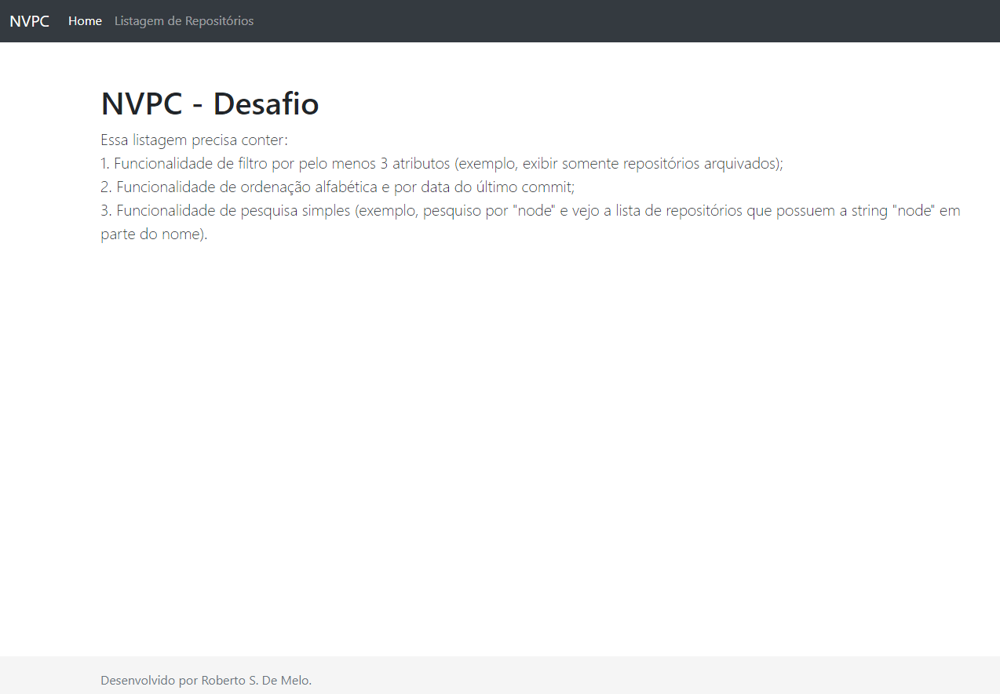
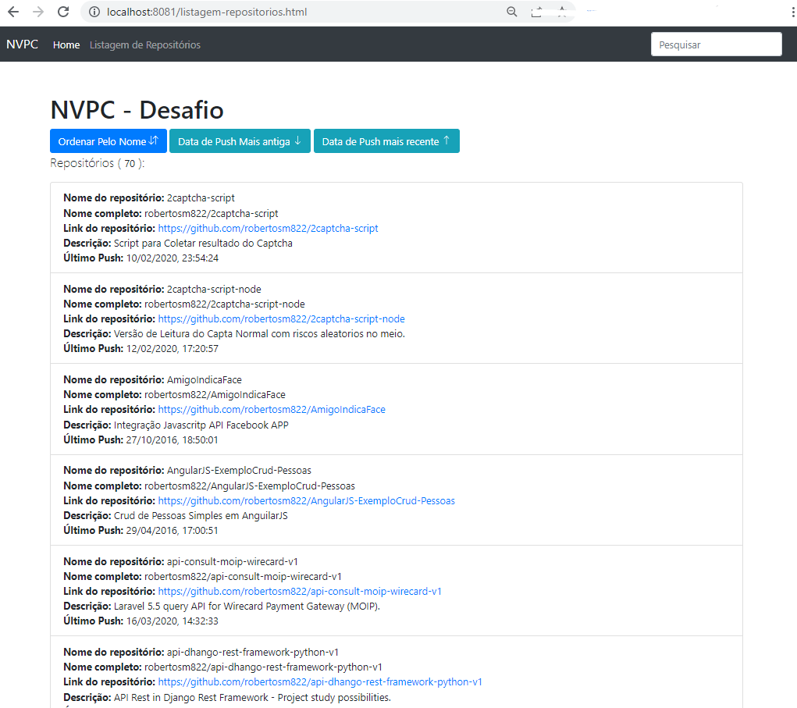

## NVPC - Desafio

### Essa listagem precisa conter:
        
1. Funcionalidade de filtro por pelo menos 3 atributos (exemplo, exibir somente repositórios
        arquivados);

2. Funcionalidade de ordenação alfabética e por data do último commit;

3. Funcionalidade de pesquisa simples (exemplo, pesquiso por "node" e vejo a lista de repositórios que possuem a string "node" em parte do nome).

## Tecnologias utilizadas para entrega do Web App

- HTML5, CSS e JavaScript;
- Biblioteca jQuery;
- Grid BootStrap 4;
- Escolhido a API Pública do GitHub;

## Screen shots do APP

Tela inicial do App:

Menu de listagem dos repositórios da conta do usuário `robertosm822`:

## Recursos da tela de Listar Repositórios

- Barra de buscar por nome do repositório (input superior direito);
- Botão de ordenar por Nome do repositório (ASC | DESC);
- Botão de ordenar por data de  `Push` mais antigo (`pushed_at`);
- Botão de ordenar por data de  `Push` mais recente (`pushed_at`);